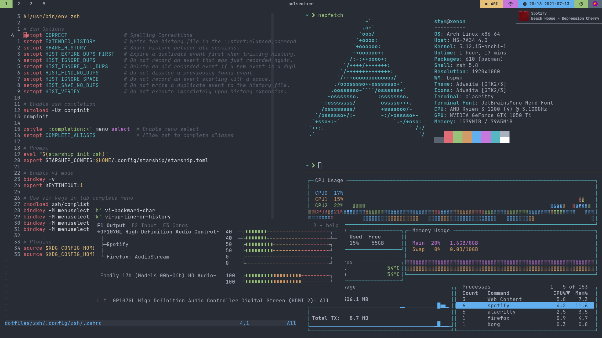

# dotfiles



## Installing

You will need `git` and GNU `stow`

Clone into your `$HOME` directory or `~`

```bash
git clone https://github.com/singhstym/dotfiles.git ~
```

Run `stow` to symlink everything or select what you want

```bash
stow */ # For everything
```

```bash
stow alacritty # For just the alacritty config
stow polybar # For just the polybar config
```
