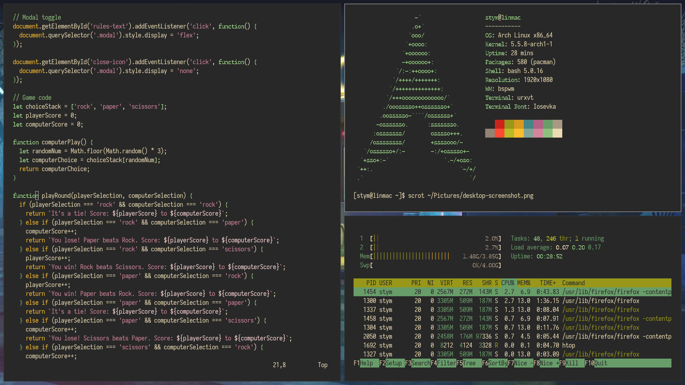

# dotfiles
### Hi there! Thanks for visiting!
This is my personal configuration for my bspwm window manager as well as my Arch Linux environment as a whole.

### Here are some details about my linux environment:
- **WM**: bspwm
- **Terminal**: URxvt
- **Font**: [Iosevka](https://github.com/be5invis/Iosevka)
- **Icons**: Papirus
- **Color Scheme**: [Gruvbox (Dark)](https://github.com/morhetz/gruvbox)
- **Compositor**: None (I don't like opacity in my terminal, it makes it harder to see information)

## Environment Details
| Category | Packages/Programs |
|--|--|
| **Distribution** | Arch Linux |
| **Window Manager** | [bspwm](https://github.com/baskerville/bspwm) with [sxhkd](https://github.com/baskerville/sxhkd) as keybindings daemon |
| **Shell** | Bash |
| **Terminal** | [URxvt](http://software.schmorp.de/pkg/rxvt-unicode.html) |
| **Display Manager** | [LightDM](https://github.com/canonical/lightdm) with [webkit2-greeter](https://github.com/antergos/web-greeter) |
| **Apps Launcher** | [dmenu](https://tools.suckless.org/dmenu/) |
| **Text Editor (CLI)** | Neovim |
| **Text Editor (GUI)** | VSCode |
| **File Manager (CLI)** | [ranger](http://ranger.github.io/) |
| **File Manager (GUI)** | PCManFM |
| **Sound Mixer** | Pulseaudio |
| **Sound Control** | Pavucontrol |
| **Network Manager** | [NetworkManager](https://wiki.gnome.org/Projects/NetworkManager/) |
| **Image Viewer** | [feh](https://feh.finalrewind.org/) |
| **Screenshot App** | [scrot](https://github.com/resurrecting-open-source-projects/scrot) |
| **System Monitor (CLI)** | htop |

**You can get the wallpaper [here](wallpaper.jpg)**.

## How to use these settings
1. Clone this repository on your local machine (preferably in your home directory).
2. Install the packages and their dependencies:
    - sudo pacman -Syu
    - sudo pacman -S bspwm lightdm lightdm-webkit2-greeter ranger rxvt-unicode feh
3. Copy the config files to their respective directories:
    - cp -r ~/dotfiles/bspwm/ ~/.config/
    - cp -r ~/dotfiles/sxhkd/ ~/.config/
    - cp -r ~/dotfiles/ranger/ ~/.config/
    - cp ~/dotfiles/lightdm/* /etc/lightdm/
    - cp ~/dotfiles/.Xresources .
    - cp ~/dotfiles/wallpaper.jpg .
4. Reboot
